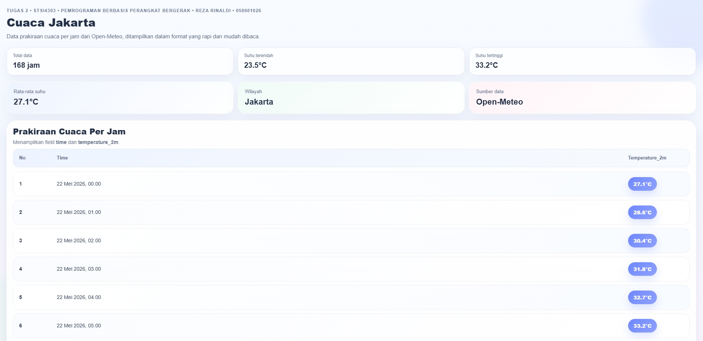

# Tugas 2 - STSI4303

## Preview UI
<p align="center">
  
</p>

## Identitas
- **Nama:** Reza Rinaldi
- **NIM:** 050601026
- **Prodi:** Sistem Informasi
- **UPJJ:** Surabaya

## Deskripsi Proyek
Aplikasi sederhana berbasis **Ionic Vue** untuk menampilkan data prakiraan cuaca per jam di Jakarta dari **Open-Meteo API**.  
Tampilan dibuat modern, ringan, dan mudah dibaca dengan pendekatan UI pastel dan komponen card-based layout.

## Fitur
- Menampilkan data cuaca dari API online
- Menampilkan field:
  - `time`
  - `temperature_2m`
- Informasi ringkas:
  - total data
  - suhu terendah
  - suhu tertinggi
  - rata-rata suhu
- Tampilan responsif dan nyaman dibaca

## Teknologi yang Dipakai
- Ionic Vue
- Vue 3 + TypeScript
- Open Meteo API
- CSS Grid & Flexbox

## Teknik CSS Modern
- Responsive Design
- Pastel Color Palette
- Glassmorphism Soft UI
- Card-Based Layout
- Gradient & Box Shadow

## Cara Menjalankan Project
```bash
npm install
ionic serve
